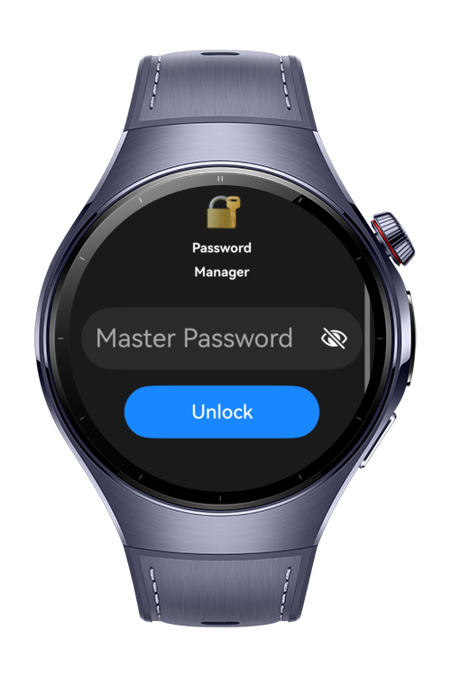
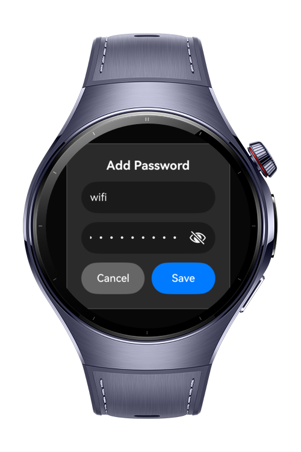

> **Note:** To access all shared projects, get information about environment setup, and view other guides, please visit [Explore-In-HMOS-Wearable Index](https://github.com/Explore-In-HMOS-Wearable/hmos-index).

# WristVault

WristVault is a lightweight password storage app designed for Huawei Watch devices, allowing users to securely store simple password entries such as Wi-Fi passwords, account passwords, and private notes.
The app supports master password protection, password reveal-on-tap, adding new entries, and deleting stored items.

# Preview

<div>
  
  
  
</div>

# Use Cases

WristVault enables users to:

- Create a secure master password to unlock the vault.
- Add password entries (e.g., “Home Wi-Fi”, “GitHub”, “Bank App”).
- Reveal stored passwords only when tapping an entry.
- Delete existing passwords easily using a cleaner UI design.
- Enjoy a simple, wrist-friendly interface optimized for Watch screens.

WristVault is ideal for people who want a super-simple private storage tool on their wearable device.

# Tech Stack

- Languages: ArkTS
- Frameworks: HarmonyOS SDK 5.1.0 (API 18+)
- Tools: DevEco Studio 5.1.0.820
- Libraries:
@kit.ArkUI for UI components
@kit.ArkData for Preferences-based storage
@kit.CryptoArchitectureKit for SHA-256 hashing

# Directory Structure

```
entry/src/main/ets/
|---entry                                 
|   |---PasswordManager.ets               // App entry component
|
|---models
|   |---PasswordEntry.ets                 // Data model (id, name, password, createdAt)
|
|---viewmodels
|   |---PasswordManagerViewModel.ets      // Business logic, storage, hashing
|
|---services
|   |---CryptoService.ets                 // Hashing using SHA-256
|   |---StorageService.ets                // Local preferences-based storage
|
|---views
|   |---SetupView.ets                     // Create master password
|   |---UnlockView.ets                    // Unlock vault using master password
|   |---PasswordListView.ets              // Add / delete / reveal password entries

``` 

# Constraints and Restrictions
## Supported Devices
Huawei Watch 5

# LICENSE

WristVault is distributed under the terms of the MIT License.  
See the [LICENSE](/LICENSE) for more information.
